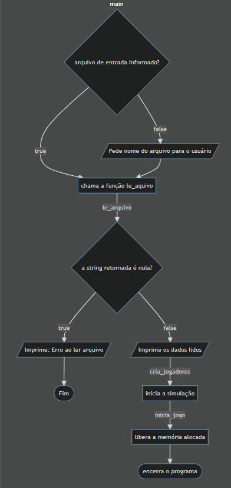
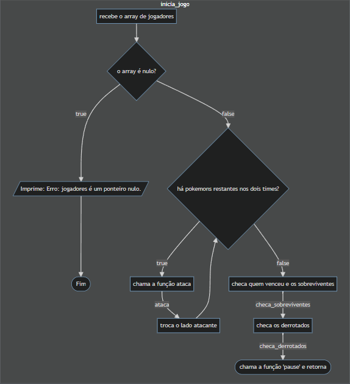
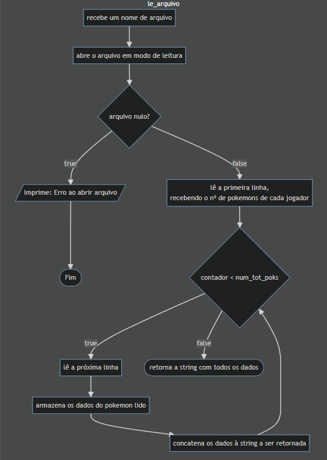
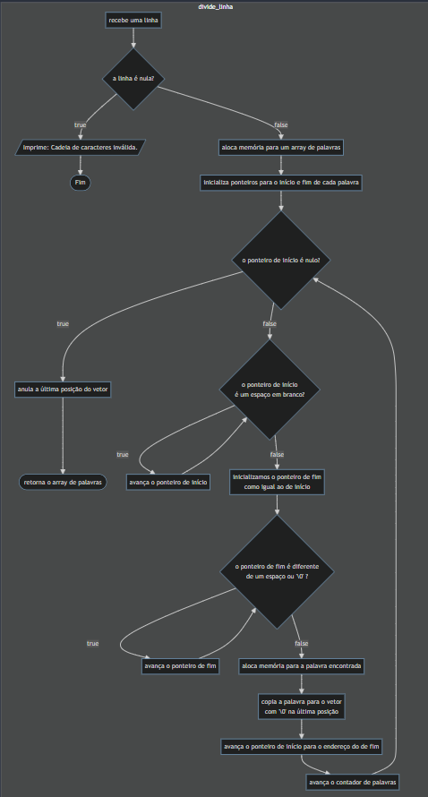
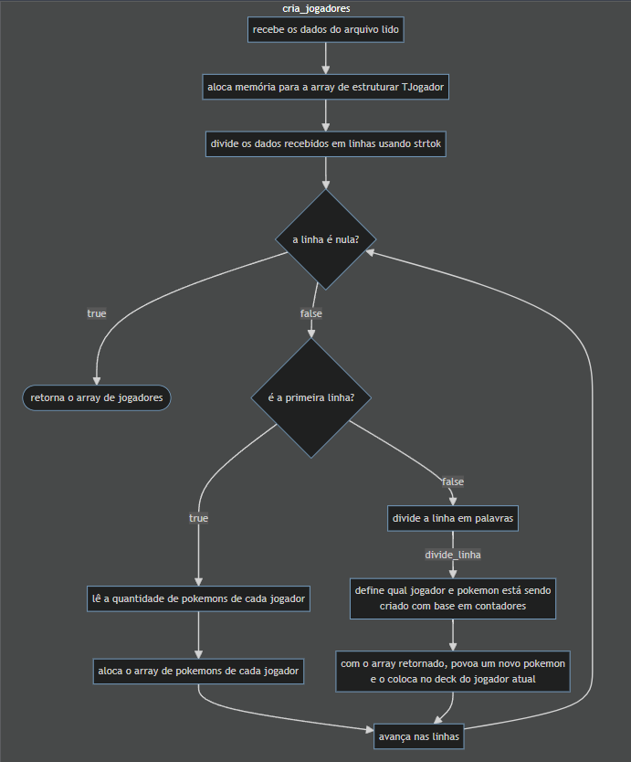
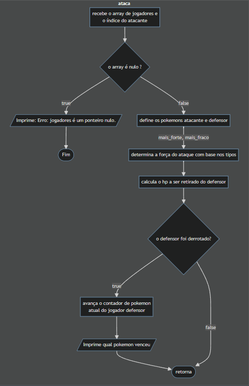
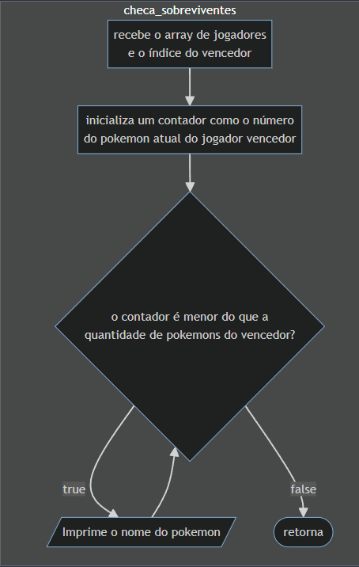
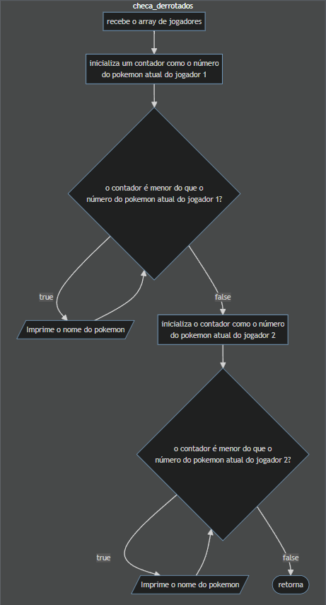

# Trabalho Pratico pds1

## Descrição

Este projeto é um trabalho prático da disciplina de PDS1 (Programação E Desenvolvimento de Software 1) do curso de Ciência de Dados da Universidade Federal de Minas Gerais.

É um simulador de batalha de Pokemons escrito em C. O usuário pode especificar um arquivo contendo os dados das equipes e o programa irá simular uma batalha entre eles. Este também registrará todos os eventos da batalha em um arquivo.

## Sumário

- [Trabalho Pratico pds1](#trabalho-pratico-pds1)
  - [Descrição](#descrição)
  - [Sumário](#sumário)
  - [Instalação e uso](#instalação-e-uso)
  - [Descrição do algoritmo e procedimentos utilizados](#descrição-do-algoritmo-e-procedimentos-utilizados)
    - [Procedimentos](#procedimentos)
    - [Diagramas](#diagramas)
      - [main](#main)
      - [inicia\_jogo](#inicia_jogo)
      - [le\_arquivo](#le_arquivo)
      - [divide\_linha](#divide_linha)
      - [cria\_jogadores](#cria_jogadores)
      - [ataca](#ataca)
      - [checa\_sobreviventes](#checa_sobreviventes)
      - [checa\_derrotados](#checa_derrotados)
  - [Licença](#licença)

## Instalação e uso

Para usar este projeto, siga os passos abaixo:

1. Clone o repositório para sua máquina local.

    ```bash
    git clone https://github.com/PolloHacker/Trabalho-Pratico-pds1.git
    ```

2. Compile o código usando o seu compilador preferido.

    - Usando o compilador GCC

        ```bash
        gcc -W -Wall -Werror src/main.c src/file_utils.c src/pok_utils.c -Iinclude -o tp_pds1
        ```

    - Usando CMake e Makefile

        Caso a compilação resulte em erro, opte pelo compilador GCC e abra um *issue* no repositório.

            mkdir build 
            cd build
            cmake ..
            make
            

3. Execute o programa gerado.

    ```bash
    ./tp_pds1.<extensão> <input_file>.txt
    ```

    Se nenhum arquivo de entrada for especificado, o programa irá pedir ao usuário um arquivo.  

## Descrição do algoritmo e procedimentos utilizados

### Procedimentos

Este projeto foi feito em C, usando a convenção de escrita [C Style Guidelines](https://www.cs.umd.edu/~nelson/classes/resources/cstyleguide/).

O programa espera a entrada em arquivos do tipo `txt`, seja pela linha de comando ou por input do usuário em tempo de execução. Os arquivos devem seguir a seguinte formatação:

```C
3 2 // número de pokemons em cada equipe
Squirtle 10 15 15 agua // os status de cada pokemon: nome ataque defesa tipo
Vulpix 15 15 15 fogo // repita para cada pokemon
Onix 5 20 20 pedra
Golem 20 5 10 pedra
Charmander 20 15 12 fogo
```

Após o input, o programa lê o arquivo linha por linha, colocando todos os dados em uma mesma string (`char *`), que será, em outra função, quebrada em palavras, sendo estas armazenadas em um vetor.  
Em seguida, as palavras serão usadas para inicializar os jogadores (`TJogador`), que possuem:

- um vetor de pokemons (`TPokemon *`).
- o número de pokemons do jogador (`int`)
- o número do pokemon atual (`int`)

Por sua vez, os pokemons (`TPokemon`) possuem:

- nome: nome do pokemon (`char *`)
- tipo: tipo do pokemon (`char *`)
- hp: pontos de vida do pokemon (`float`)
- atk: ataque do pokemon (`float`)
- def: defesa do pokemon (`float`)

Depois da inicialização, os pokemons tomam turnos em pares, ou *rounds*, para se enfrentarem até um ser derrotado. Quando isso acontece, o contador de pokemon atual do jogador defensor avança em 1.  
Esses *rounds* acontecem até algum dos dois jogadores ficar sem pokemons (contador atual == número de pokemons).  
Ao final, os nomes dos pokemons sobreviventes e derrotados são impressos em listas diferentes e o programa é encerrado.

### Diagramas

Os diagramas foram feitos usando a biblioteca [Mermaid](https://mermaid.js.org/).

Caso as imagens estejam borradas ou a visualização esteja difícil, é possivel ver os diagramas em [Mermaid Live Editor](https://mermaid.live/edit) usando o arquivo [json](diagramas-mermaid.json) ou o [txt](diagramas-mermaid-code.txt), caso o editor não consiga ler o json.

#### main



#### inicia_jogo



#### le_arquivo



#### divide_linha



#### cria_jogadores




#### ataca



#### checa_sobreviventes



#### checa_derrotados



## Licença

Este projeto está licenciado sob [MIT License](LICENSE).
